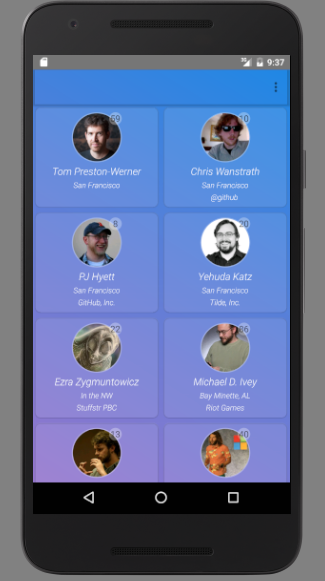
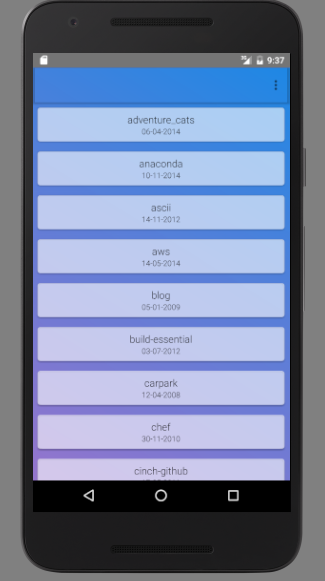

# GithubUsers Android App

The app shows users (cards with their info: photo with the count of repositories, name, location, company) in order they signed up on GitHub.
Tapping on the user you will see the list of their repositories (name and creation date). 
Based on MVP pattern. Works with Github API.

## Screenshots

### Built With

* [Java 8](https://java.com/en/download/)
* [RxJava](https://github.com/ReactiveX/RxJava) - A library for composing asynchronous and event-based programs
* [Glide](https://github.com/bumptech/glide) - Image loading framework
* [ThreeTenABP](https://github.com/JakeWharton/ThreeTenABP) - Working with time
* [CircleImageView](https://github.com/hdodenhof/CircleImageView) - Let create circle image views
* [OkHttp](http://square.github.io/okhttp/) - Http client
* [Retrofit](http://square.github.io/retrofit/) - Http client
* [Retrolambda](https://github.com/evant/gradle-retrolambda) - Plugin for lambdas using
